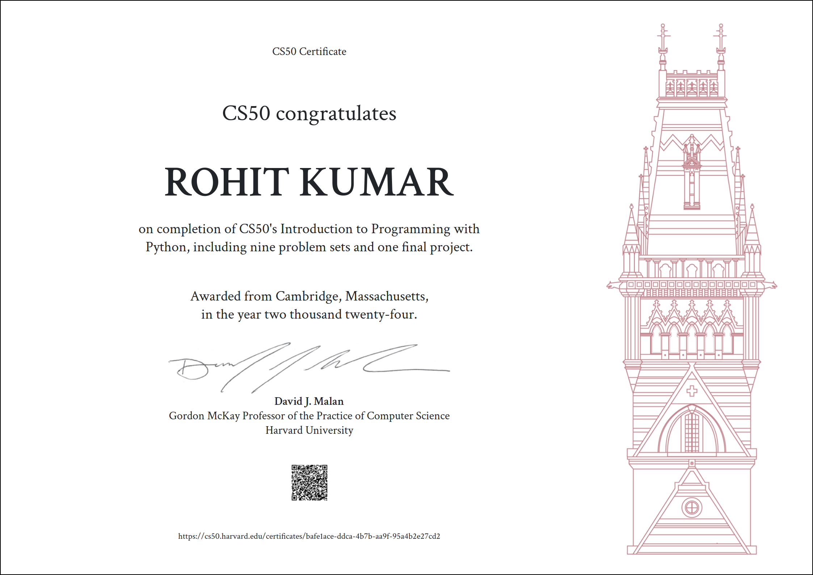

# CS50’s Introduction to Programming with Python

### These are my solutions for CS50's Introduction to Programming with Python.
### Final Project: [Finance Manager](https://youtu.be/hQFNb8llMVA)
 

## :warning: Disclaimer:

### ❗ **The following codes are for educational purpose only and not intended to be used / submitted as your own solutions.**

### ❗ **Cheating violates the [Academic Honesty](https://cs50.harvard.edu/python/2022/honesty/) of the course, not to mention it's totally pointless if you actually want to learn programming.**

 

## Table of Contents
### [Week 0](python/psets0/) - [Functions, Variables](https://cs50.harvard.edu/python/2022/weeks/0/)
- [Indoor Voice](/python/psets0/indoor/)
- [Playback Speed](python/psets0/playback/)
- [Making Faces](python/psets0/faces/)
- [Einstein](python/psets0/einstein/)
- [Tip Calculator](python/psets0/tip/)

### [Week 1](python/psets1/) - [Conditionals](https://cs50.harvard.edu/python/2022/weeks/1/)
- [Deep Thought](python/psets1/deep/)
- [Home Federal Savings Bank](python/psets1/bank/)
- [File Extensions](python/psets1/extensions/)
- [Math Interpreter](python/psets1/interpreter/)
- [Meal Time](python/psets1/meal/)

### [Week 2](python/psets2/) - [Loops](https://cs50.harvard.edu/python/2022/weeks/2/)
- [camelCase](python/psets2/camel/)
- [Coke Machine](python/psets2/coke/)
- [Just setting up my twttr](python/psets2/twttr/)
- [Vanity Plates](python/psets2/plates/)
- [Nutrition Facts](python/psets2/nutrition/)

### [Week 3](python/psets3/) - [Exceptions](https://cs50.harvard.edu/python/2022/weeks/3/)
- [Fuel Gauge](python/psets3/fuel/)
- [Felipe's Taqueria](python/psets3/taqueria/)
- [Grocery List](python/psets3/grocery/)
- [Outdated](python/psets3/outdated/)

### [Week 4](python/psets4/) - [Libraries](https://cs50.harvard.edu/python/2022/weeks/4/)
- [Emojize](python/psets4/emojize/)
- [Frank, Ian and Glen's Letters](python/psets4/figlet/)
- [Adieu, Adieu](python/psets4/adieu/)
- [Guessing Game](python/psets4/game/)
- [Little Professor](python/psets4/professor/)
- [Bitcoin Price Index](python/psets4/bitcoin/)

### [Week 5](python/psets5/) - [Unit Tests](https://cs50.harvard.edu/python/2022/weeks/5/)
- [Testing my twttr](python/psets5/test_twttr/)
- [Back to the Bank](python/psets5/test_bank/)
- [Re-requesting a Vanity Plate](python/psets5/test_plates/)
- [Refueling](python/psets5/test_fuel/)

### [Week 6](python/psets6/) - [File I/O](https://cs50.harvard.edu/python/2022/weeks/6/)
- [Lines of Code](python/psets6/lines/)
- [Pizza Py](python/psets6/pizza/)
- [Scourgify](python/psets6/scourgify/)
- [CS50 P-Shirt](python/psets6/shirt/)

### [Week 7](python/psets7/) - [Regular Expressions](https://cs50.harvard.edu/python/2022/weeks/7/)
- [NUMB3RS](python/psets7/numb3rs/)
- [Watch on YouTube](python/psets7/watch/)
- [Working 9 to 5](python/psets7/working/)
- [Regular, um, Expressions](python/psets7/um/)
- [Response Validation](python/psets7/response/)

### [Week 8](python/psets8/) - [Object-Oriented Programming](https://cs50.harvard.edu/python/2022/weeks/8)
- [Seasons of Love](python/psets8/seasons/)
- [Cookie Jar](python/psets8/jar/)
- [CS50 Shirtificate](python/psets8/shirtificate/)
